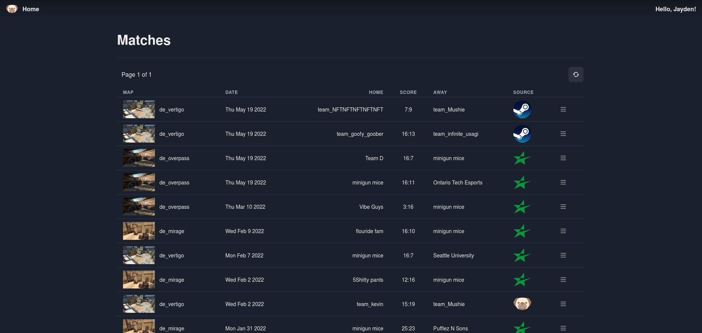
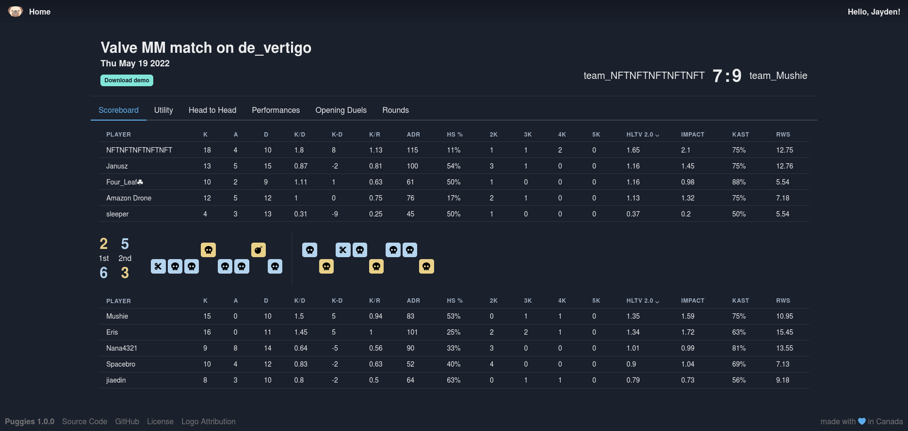
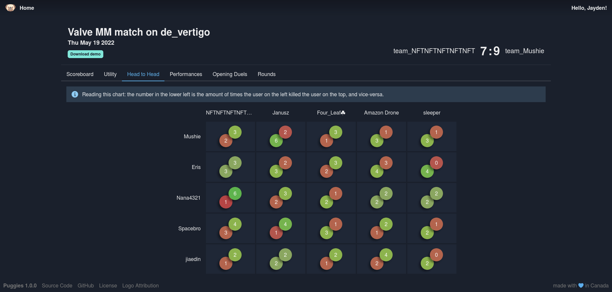
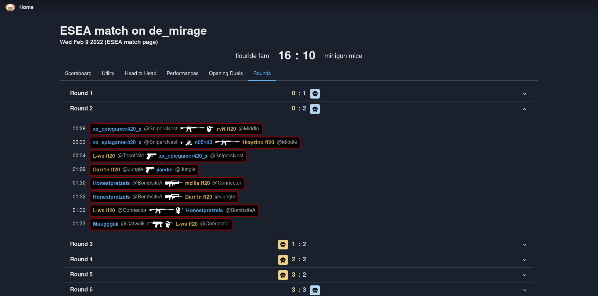

# Puggies

Puggies is a self-hosted CS:GO demo analyzer and statistics platform.

## Features
* Wide range of basic stats available (k/a/d, K/D, ADR, HS%, HLTV, RWS, many more)
* Utility usage stats (nades thrown, utility damage, flash assists, etc)
* Head-to-head tables
* Individual performance stats
* Opening duels, trade kills, opening success rate, etc
* Round-by-round breakdowns with killfeed, kill locations, bomb plants & defuses
* Small docker image (~40MB)

## Documentation
* [Installation](./docs/Installation.md)
* [Configuration](./docs/Configuration.md)
* [Development](./docs/Development.md)

## Screenshots

